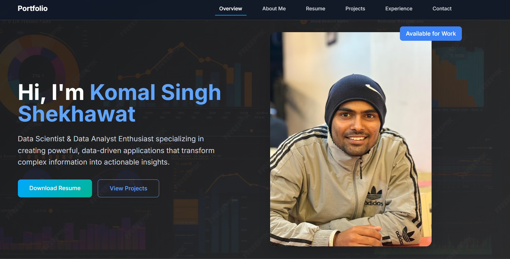
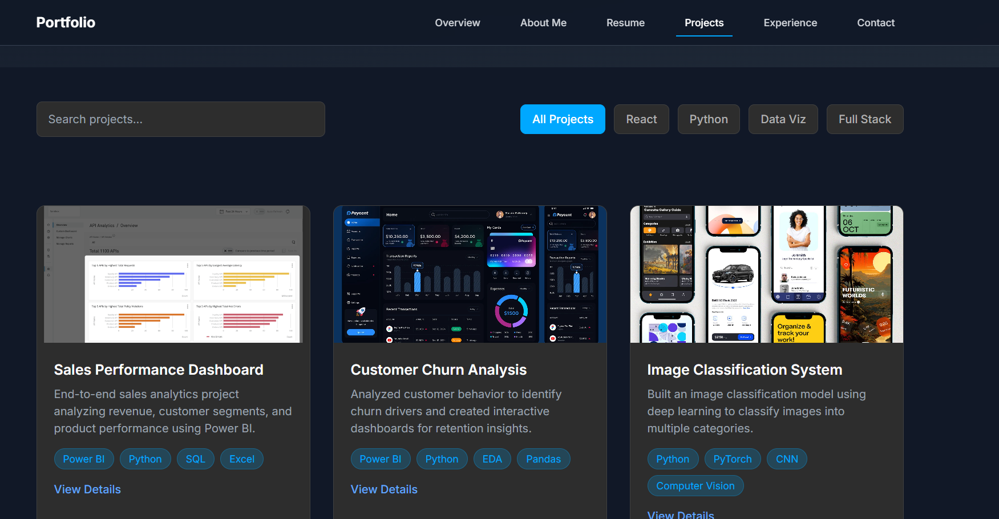
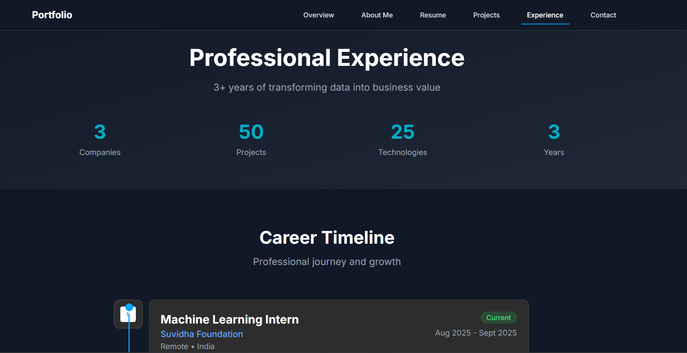
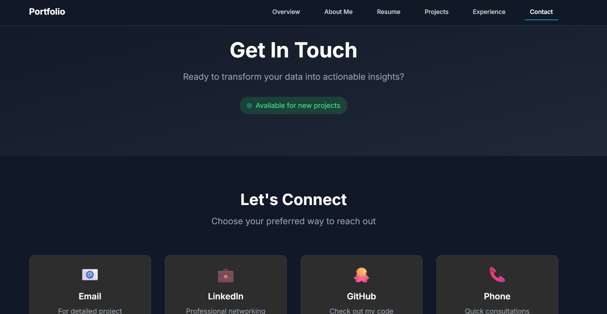

# KomalSingh-Portfolio
<!-- ===================== -->
<!-- README BANNER -->
<!-- ===================== -->

  

<h3 align="center">
Data Analyst • Data Scientist • Machine Learning Enthusiast
</h3>

  🌐 <a href="https://komal-singh-shekhawat-portfolio.vercel.app/">Live Portfolio</a> • 
  💼 <a href="https://www.linkedin.com/">LinkedIn</a> • 
  🐙 <a href="https://github.com/">GitHub</a>

---

## 👋 About Me

I’m **Komal Singh Shekhawat**, a **BTech CSE (AIML) final-year student** passionate about  
**Data Analytics, Data Science, Machine Learning, and Business Intelligence**.

I specialize in:
- Turning raw data into **actionable insights**
- Building **Power BI dashboards**
- Creating **end-to-end ML & analytics projects**
- Deploying **modern web portfolios**

---

## 🚀 Live Portfolio

🔗 **Visit here:**  
👉 https://komal-singh-shekhawat-portfolio.vercel.app/

---

## 🧰 Tech Stack & Skills

### 🧠 Data & Analytics

### 💻 Web & Tools

---

## 📊 GitHub Stats

  
  

---

## 📂 Featured Projects

✔ **OLA Performance Dashboard** – Power BI business analytics  
✔ **Movie Recommender System** – ML + cosine similarity  
✔ **Customer Churn Analysis** – Business decision insights  
✔ **Facial Recognition Attendance System** – Computer Vision  
✔ **E-commerce Analytics Dashboard** – Revenue & funnel analysis  

> Each project follows:
> **Problem Framing → Data Cleaning → EDA → Modeling → Visualization → Insights**

---

## 🖼️ Portfolio Preview

  
  

  
  

> 📌 *Add screenshots inside an `assets/` folder*

---

## 🎯 Why This Portfolio?

- Built for **recruiters & hiring managers**
- Highlights **real-world data projects**
- Demonstrates **business + technical thinking**
- Optimized for **Data Analyst / Data Scientist roles**

---

## 📬 Contact

📧 Email: *your-email*  
💼 LinkedIn: *your-linkedin*  
🌐 Portfolio: https://komal-singh-shekhawat-portfolio.vercel.app/

---

⭐ **If you like this portfolio, don’t forget to star the repo!**

  

